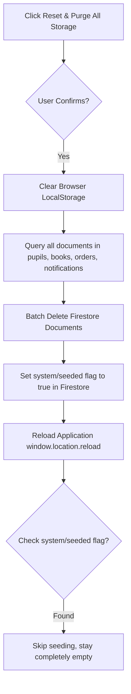

# 🛠️ Nazareth School Store & Portal: Reset & Purge Action Guide

This document details how data deletion, item purging, order cancellation, and global system resets operate across the application. It outlines the specific handlers, state transitions, database operations, and browser caching resets associated with each action.

---

## 📋 Actions Summary Table

| Action Level | UI Button Label | Context Location | Primary Code Handler | Database / System Effects |
| :--- | :--- | :--- | :--- | :--- |
| **Pupil Account** | `Trash Icon` | Registered Pupil Base | `handleDeletePupil` in [AdminDashboard.tsx](file:///c:/Users/ch4oy/OneDrive/Desktop/e_cormmerce/src/components/AdminDashboard.tsx) | Removes the pupil's document from the Firestore `"pupils"` collection and logs an administrative system notification. |
| **Catalog Item** | `Purge` | Consignment Stock Inventory | `handleDeleteBook` in [AdminDashboard.tsx](file:///c:/Users/ch4oy/OneDrive/Desktop/e_cormmerce/src/components/AdminDashboard.tsx) | Deletes the book's document from the Firestore `"books"` collection, removing it from the store catalog. |
| **Order Cancellation** | `Annull` | Bookshop Ledger Invoices | `handleDeleteOrder` in [AdminDashboard.tsx](file:///c:/Users/ch4oy/OneDrive/Desktop/e_cormmerce/src/components/AdminDashboard.tsx) | Replenishes catalog stock for items in the order, and updates the invoice status to `"Cancelled"` in the Firestore `"orders"` collection. |
| **Order Permanent Delete** | `Delete` | Bookshop Ledger Invoices | `handleDeleteOrderPermanently` in [AdminDashboard.tsx](file:///c:/Users/ch4oy/OneDrive/Desktop/e_cormmerce/src/components/AdminDashboard.tsx) | Replenishes stock (if order was not already cancelled) and deletes the invoice document from the Firestore `"orders"` collection. |
| **Global System Reset** | `Reset & Purge All Storage` | GDPR Sandbox Auditor | `handleSystemPurge` in [AdminDashboard.tsx](file:///c:/Users/ch4oy/OneDrive/Desktop/e_cormmerce/src/components/AdminDashboard.tsx) and [App.tsx](file:///c:/Users/ch4oy/OneDrive/Desktop/e_cormmerce/src/App.tsx) | Clears client `LocalStorage`, wipes all documents in Firestore collections (`pupils`, `books`, `orders`, `notifications`), sets/maintains the global seed flag to `true`, and triggers a full application reload without doing any factory re-seeding (leaving the app completely empty). |

---

## 🔍 Detailed Walkthrough of Action Flows

### 1. Delete Pupil
When the registrar clicks the Trash button next to a pupil in the registered pupil base:
1. A verification confirmation dialog is prompted: `"Are you sure you want to delete pupil [Name]?"`.
2. Upon confirmation, `handleDeletePupil` triggers.
3. The pupil is filtered out of the local React `pupils` state list.
4. The helper function `onUpdatePupils` is invoked, which routes to `syncCollection` in [App.tsx](file:///c:/Users/ch4oy/OneDrive/Desktop/e_cormmerce/src/App.tsx) to perform a Firestore batch delete on that student's record (`doc(db, 'pupils', id)`).
5. A system notification with `role: 'admin'` is created and pushed to the notifications collection to log the deletion action.

### 2. Purge Book (Catalog Item)
When the registrar clicks the **Purge** button on an item in the Consignment Stock Catalog:
1. A confirmation dialog is shown: `"Are you sure you want to remove this book from the Nazareth catalog?"`.
2. Upon confirmation, `handleDeleteBook` runs.
3. The catalog item is removed from the local `books` React list.
4. The helper `onUpdateBooks` is called, syncing the deletion to the Firestore `"books"` collection.
5. The item is removed from the shop preview for all users.

> [!WARNING]
> Purging a book catalog item will make it unavailable for purchase immediately, but does not alter historical sales orders that already referenced its ID.

---

### 3. Order Management: Annull vs. Delete

#### A. Annull (Cancel Order)
When an active order is cancelled by clicking **Annull**:
1. A confirmation dialog appears: `"Cancel this pending order ledger record?"`.
2. The system checks if the order's status is not already `"Cancelled"`.
3. If it is active, the system loops through the order's items and replenishes the respective book stock count in the books catalog.
4. The order status is updated to `"Cancelled"`.
5. The order and book updates are synced to the Firestore `"orders"` and `"books"` collections.

#### B. Delete (Permanent Invoice Purge)
When an order is deleted permanently by clicking the **Delete** button:
1. A confirmation dialog appears: `"Are you sure you want to permanently delete this invoice? This will also remove it from the system and Firestore."`.
2. If the order was not already cancelled, the system first replenishes the inventory stock of the catalog books.
3. The order is removed entirely from the state array.
4. The order document is deleted from the Firestore `"orders"` collection.

---

### 4. Reset & Purge All Storage (GDPR Institutional Reset)
Located at the bottom of the **GDPR Sandbox Auditor** tab in the Faculty Suite, clicking **Reset & Purge All Storage** triggers a complete cleanup cycle:

#### Code Workflow Under the Hood:
1. **Confirmation**: A modal prompt warns: `"WARNING: This will completely flush all custom LocalStorage records and permanently delete all documents from the database. No factory re-seeding will be done. Do you wish to proceed?"`.
2. **Browser LocalStorage Clearance**: `localStorage.clear()` is called. This clears:
   - Pupil wishlists (`nazareth_wishlist_[id]`)
   - Pupil recently viewed items (`nazareth_recent_viewed_[id]`)
   - GDPR consent state (`nazareth_gdpr_consent`)
3. **Firestore Collections Flush**: Inside `handleSystemPurge` in [App.tsx](file:///c:/Users/ch4oy/OneDrive/Desktop/e_cormmerce/src/App.tsx), the system queries all documents across:
   - `pupils`
   - `books`
   - `orders`
   - `notifications`
   and wipes them using Firestore `writeBatch`.
4. **Seed Flag Preservation**: Sets/maintains the database document at `doc(db, 'system', 'seeded')` with `{ seeded: true }`.
5. **Web App Reload**: Calls `window.location.reload()`.
6. **No Factory Reseeding**: On reload, `App.tsx`'s `initFirebase()` runs. Because the `system/seeded` document already exists, the `seedCollectionIfEmpty` function skips writing initial factory records, keeping the Firestore database completely clean and empty (0 pupils, 0 catalog books, 0 ledger orders, and 0 notifications).

---

> [!IMPORTANT]
> The **Reset & Purge All Storage** action requires complete administrative authority and should only be used during system testing or when carrying out clean school-term rollovers.
