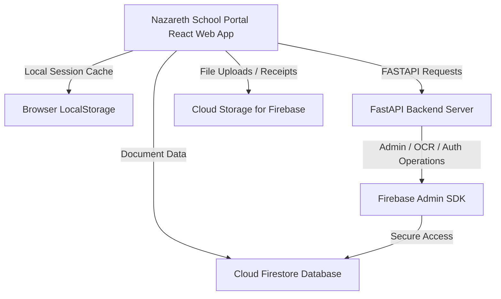

# 📦 Nazareth School Store & Portal: Storage Capacity & Expansion Blueprint

This document provides a detailed breakdown of the storage architecture, capacities, limits, and expansion pathways for the Nazareth School Store & Parent Portal application.

---

## 🏛️ Storage Architecture Overview

The application utilizes a multi-tiered storage architecture, leveraging Firebase cloud infrastructure for databases and assets, browser-side caching for local state, and container-level ephemeral memory for backend execution.

---

## 📊 Capacity Breakdown by Storage Tier

| Storage Tier | Technology | Free Tier Capacity (Spark Plan) | Paid / Production Capacity (Blaze Plan) | Primary Use Case in App |
| :--- | :--- | :--- | :--- | :--- |
| **Document Database** | Cloud Firestore | **1 GiB** total storage | **Virtually Unlimited** (Scales to petabytes) | Student profiles, books catalog, order history, notifications, attendance. |
| **Object File Storage** | Cloud Storage | **5 GiB** total storage | **Infinitely Scalable** | Bank transfer payment receipts (`.png`, `.jpg`, `.pdf`). |
| **User Authentication** | Firebase Auth | **Unlimited** email accounts / **10k** SMS/month | **Scales to Millions** | School Registrar logins, parent credentials, student logins. |
| **Client Caching** | LocalStorage | **5 MiB – 10 MiB** per browser | Limited by user's browser specification | Local settings, GDPR consent state, session tokens. |
| **Backend App Disk** | Cloud Run Ephemeral | **Storage matches RAM** (up to 32 GB RAM configurations) | Horizontal/Vertical autoscaling | Temporary PDF generation, image compression buffers. |

---

## 🚀 Deep-Dive into Database Limits (Cloud Firestore)

Firestore is highly optimized for document storage. The limits under the current integration are:

### 1. Document Limits
*   **Maximum Document Size**: **1 MiB** (1,048,576 bytes).
    *   *Nazareth Context:* A typical student document ([Pupil](file:///c:/Users/ch4oy/OneDrive/Desktop/e_cormmerce/src/types.ts#L13-L22)) is only **~300 bytes**. You can store over **3.4 million students** in a single gigabyte of storage.
*   **Maximum Write Rate per Document**: **1 write per second**.
    *   *Nazareth Context:* More than sufficient for student profiles and catalog stock updates.
*   **Maximum Fields per Document**: **20,000 fields**.

### 2. Transaction and Rate Limits
*   **Writes per Batch**: Up to **500 write operations** per atomic batch.
    *   *Nazareth Context:* When importing students via the [Excel Bulk Onboarder](file:///c:/Users/ch4oy/OneDrive/Desktop/e_cormmerce/src/components/AdminDashboard.tsx#L339-L350), rows are saved using Firestore batches. If you upload more than 500 rows at once, the app handles sync operations gracefully or chunks them.
*   **Daily Free Limits**:
    *   **50,000 Reads** per day.
    *   **20,000 Writes** per day.
    *   **20,000 Deletes** per day.

---

## 📂 Object Storage Details (Cloud Storage for Firebase)

Used when parents upload proof-of-payment receipts for bank transfer orders.
*   **File Size Capacity**: Single files can be up to **5 TiB** (standard Google Cloud Storage limit).
*   **Nazareth Store Recommendation**: Keep uploaded receipt sizes optimized (e.g., maximum **5 MB** per image) to preserve download bandwidth limits.
*   **Daily Free Limits**:
    *   **5 GiB** total stored files.
    *   **1 GB** daily download bandwidth.
    *   **20,000 Upload** operations/day.
    *   **50,000 Download** operations/day.

---

## ⚡ Expansion Pathway & Scaling Operations

If the school's volume exceeds the free tier parameters (e.g., more than 5,000 students, or hundreds of high-res payment receipts uploaded daily), the system can be scaled seamlessly with **zero code modifications**.

### 1. Upgrading Firebase Plan (Spark ➡️ Blaze)
To lift the 1 GiB database and 5 GiB storage limits, upgrade the project `nazareth-e739f` to the **Blaze (Pay-As-You-Go)** plan in the Firebase Console:
1. Go to the [Firebase Console](https://console.firebase.google.com/).
2. Select the `nazareth-e739f` project.
3. Click **Upgrade** in the bottom-left corner.
4. Select the **Blaze Plan** and link a billing account.

> [!TIP]
> Google Cloud provides budget alerts. You can configure a billing alert in the Google Cloud Console to notify you if monthly charges exceed a set threshold (e.g., $10).

### 2. Paid Tier Unit Cost Estimates (Beyond Free Tier)
Under the Blaze Plan, you only pay for what you use:
*   **Extra Firestore Database Storage**: **$0.18 per GiB** per month.
*   **Extra Document Operations**:
    *   Reads: **$0.06 per 100,000** documents.
    *   Writes: **$0.18 per 100,000** documents.
*   **Extra Cloud Storage (Files)**: **$0.026 per GB** per month.
*   **Storage Download Egress**: **$0.12 per GB** downloaded.

### 3. Backend Execution Expansion (FastAPI)
The backend service routes defined in [backend/routers](file:///c:/Users/ch4oy/OneDrive/Desktop/e_cormmerce/backend/routers) are built to run in serverless containers (like Google Cloud Run).
*   **Vertical Scaling**: Memory can be adjusted from **128 MiB up to 32 GiB**, and CPU from **1 vCPU up to 8 vCPUs** per instance.
*   **Horizontal Scaling**: Cloud Run automatically scales from **0 to 1,000+ concurrent instances** depending on traffic load.

---

## 🛡️ Storage Integrity and Purging
To protect database capacity and user privacy, the application includes a **System Purge** feature on the Faculty Suite interface. This performs an administrative flush of custom records and resets the initial state.

> [!WARNING]
> Running a System Purge is destructive. Make sure to download a **GDPR Ledger Backup JSON** from the Admin Workspace before executing a reset.
